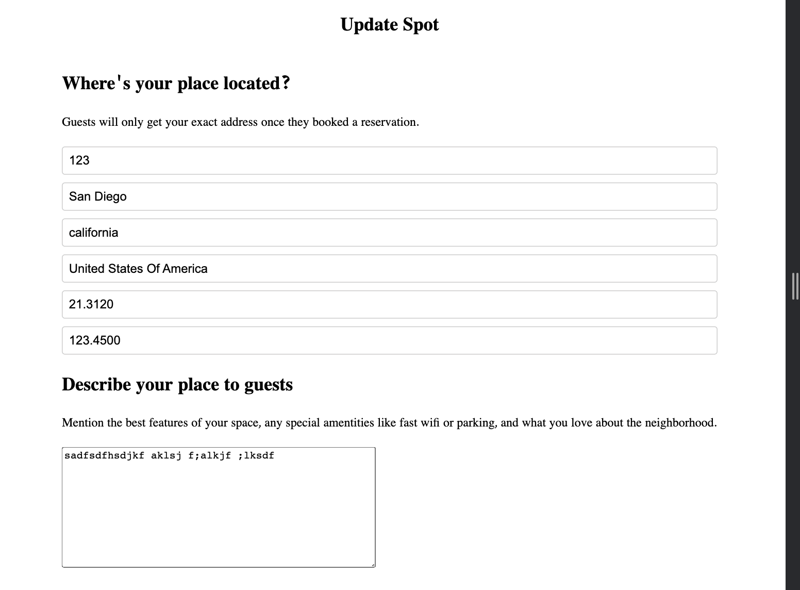

INTRODUCTION:
  - Located at project root (`/`)
  - Link to live site: https://stay-inns.onrender.com

DESCRIPTION:
  This project is a clone of AirBnB. It has two features, Spot and Review. The Spot feature has full CRUD and the review feature has CRD. The user will be able to create a new spot, manage the spots they own, and write reviews for spots that do not belong to them. Upon landing on the main page, all spots will be loaded. Each spot tile has the location, price per night, and star rating. In addtion, when hovered over the spot a tooltip will appear with the spot name. The user can click anywhere on the spot and it will navigate them to that spot's detail page. The spot detail page will have a preview image with four small images. Also, it will contain a callout box that has the price per night, star rating, and number of reviews.

TECHNOLOGIES USED:
  - Render
  - MacBook
  - VSCode

FEATURES:
  Spots:
    
  Create a New Spot:
    
  Manage Spot:
    
    
  User:
   When not logged in: 
   Sign up: 
   Log in: 
   User-summary pop-up: 

TO-DO LIST:
  - Complete Bookings feature
  - Add search bar
  - Google Maps on Search
  - Favorites
  - Messaging
  - User/Host profiles
  - AWS/S3 Image Upload

GET STARTED:
  1. Github link: https://github.com/huynhlam56/API-project
  2. Build commands:
    npm install && npm run render-postbuild && npm run build  && npm run sequelize --prefix backend db:migrate && npm run sequelize --prefix backend db:seed:all
